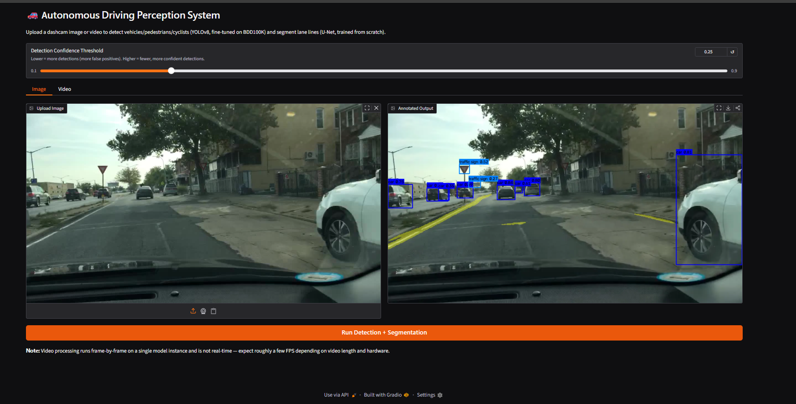
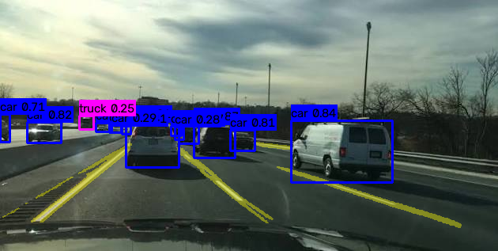
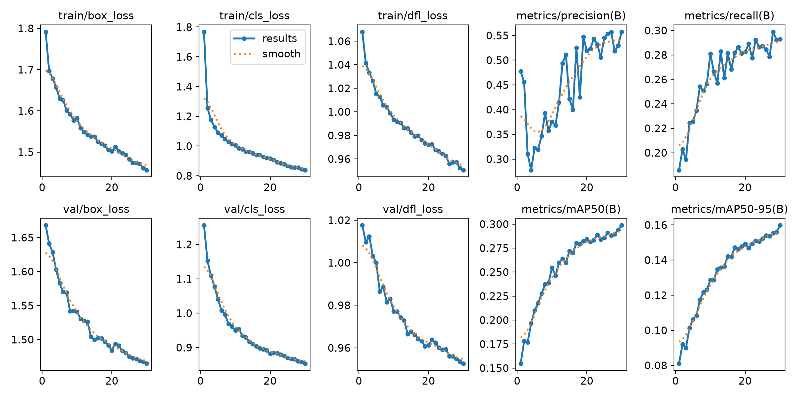
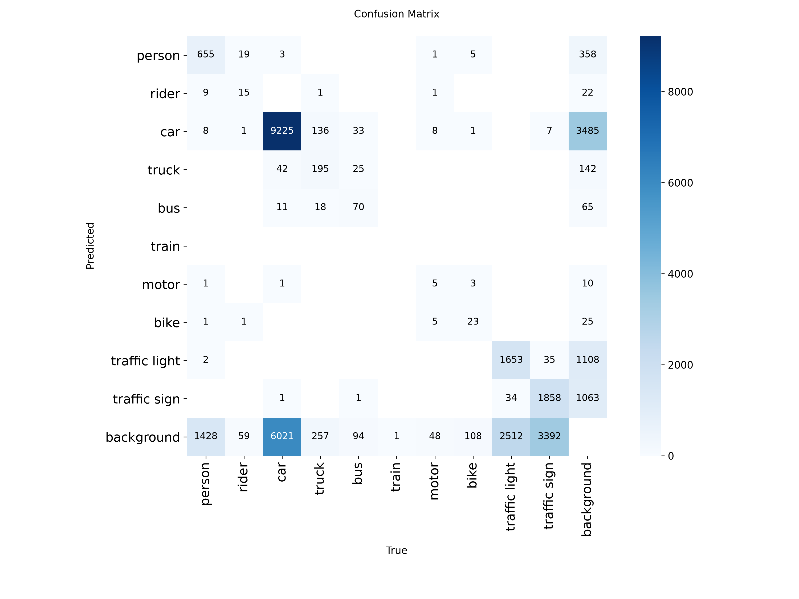
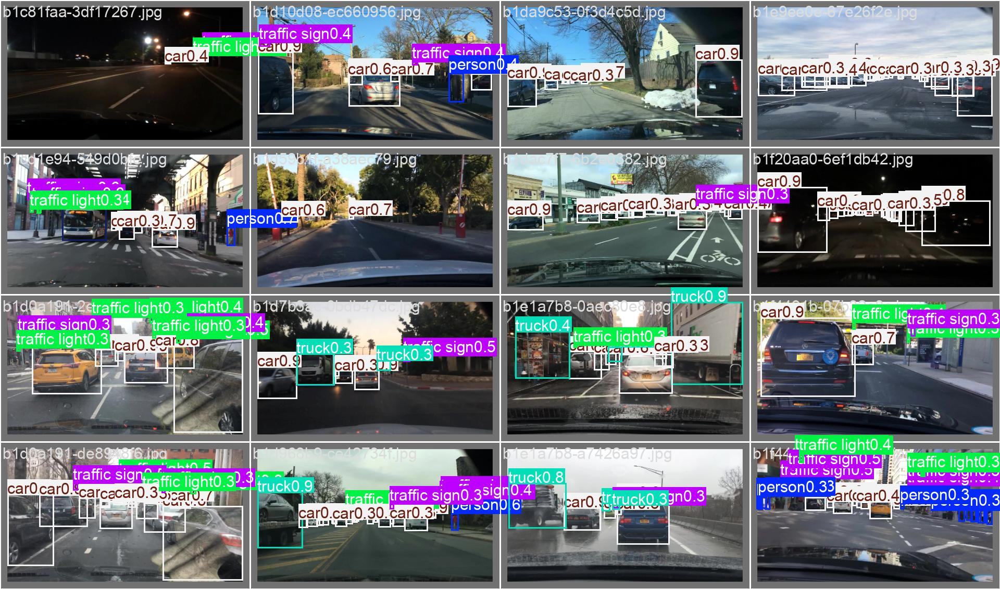

# 🚗 Autonomous Driving Perception System

A multi-task perception pipeline for dashcam footage, combining object detection,
lane segmentation, and a from-scratch Feature Pyramid Network — built end-to-end
from data pipeline to deployed web app.

## Demo


*Real-time pipeline: YOLOv8 vehicle/pedestrian detections (bounding boxes) +
U-Net lane segmentation (yellow overlay) running together on highway dashcam footage.*

---

## Web App



*Gradio interface: upload a dashcam image or video, adjust confidence threshold,
and view the annotated output side-by-side with the original.*

---

## Overview

This project detects vehicles, pedestrians, and cyclists in dashcam footage and
segments lane lines, deployed as an interactive Gradio web app. It was built as a
learning project to go deep on both applying pretrained models (transfer learning)
and implementing core architectures from scratch.

**Core components:**
- **YOLOv8n** fine-tuned on BDD100K for 10-class object detection
- **U-Net** built from scratch (encoder/decoder + skip connections) for binary lane segmentation
- **Feature Pyramid Network** built from scratch and unit-tested independently for multi-scale feature fusion
- **Gradio** web interface supporting image and video upload with an adjustable confidence threshold

---

## Pipeline Output



*Combined pipeline output on a single dashcam frame: car/truck detections with
confidence scores and yellow lane line overlay.*

---

## Architecture

```
                    Dashcam Frame
                         │
           ┌─────────────┴─────────────┐
           ▼                           ▼
   YOLOv8n (fine-tuned)         U-Net (from scratch)
   10-class detection           Binary lane segmentation
           │                           │
           └─────────────┬─────────────┘
                         ▼
              Combined annotated output
              (boxes + lane overlay)
```

*The Feature Pyramid Network (`models/fpn.py`) was built and verified independently
with dummy multi-scale tensors as an architecture deep-dive — it demonstrates the
same multi-scale feature fusion principle used inside YOLO's neck, without being
wired into the full training loop.*

---

## Results

### Detection — YOLOv8n fine-tuned on BDD100K (30 epochs, 8K images)

| Metric | Score |
|---|---|
| mAP@50 | 0.299 |
| mAP@50-95 | 0.160 |
| Precision | 0.557 |
| Recall | 0.293 |

### Lane Segmentation — U-Net from scratch (25 epochs, 8K images)

| Metric | Score |
|---|---|
| Best Val Dice | 0.060 |

**Hardware:** Trained on a single NVIDIA RTX 3050 4GB VRAM (laptop). Model
variants, dataset size, and training config were deliberately scoped to fit this
budget — see [Design Decisions](#design-decisions--tradeoffs) below.

Full training curves and logs: `[paste your public W&B project URL here]`

### Training curves



*All three loss components trending down steadily. mAP@50 and mAP@50-95 trending
up consistently across 30 epochs — both still climbing at epoch 30, suggesting
further improvement with more epochs.*

### Confusion matrix



*Car is by far the dominant class in BDD100K (as expected for dashcam footage),
with strong diagonal scores. Smaller/rarer classes (rider, train, motor) show
lower recall due to limited examples in the subsampled training set.*

### Validation batch predictions



*Sample validation batch across diverse BDD100K scenes: daytime/nighttime,
urban streets, highways. Model generalizes across lighting conditions and scene types.*

---

## Design Decisions & Tradeoffs

Being upfront about constraints and the reasoning behind them:

- **YOLOv8n over larger variants (s/m/l):** chosen to fit 4GB VRAM comfortably
  at a reasonable batch size. Larger variants would likely improve mAP significantly
  given more VRAM headroom.

- **8,000 / 1,500 image train/val subset instead of the full ~70K/10K BDD100K
  set:** the download turned out to be the full 70K dataset rather than the
  expected 10K subset. A reproducible random subsample (fixed `seed=42`) was built
  to keep training time practical while preserving class diversity.

- **Mixed precision training (AMP):** U-Net training initially took ~2 hours per
  epoch. Diagnosing with `nvidia-smi` showed the GPU was compute-bound at 100%
  utilization — not data-starved — so adding `torch.amp` reduced this to ~22
  minutes per epoch (roughly 5-6x speedup) by running forward passes in fp16
  where numerically safe.

- **U-Net `base_features=32`** instead of the original paper's 64, halving
  parameter count and memory footprint at an acceptable capacity tradeoff for
  a 4GB VRAM budget.

- **Dice + BCE combined loss** for U-Net rather than BCE alone — lane pixels are
  a small minority of each image (~3%), and Dice loss handles this class imbalance
  far better than pixel-wise BCE by directly measuring region overlap.

- **Windows-specific Gradio file-serving bug:** `gr.Video` triggered a race
  condition where Gradio's browser preview tried to stream the uploaded file
  before Windows released its write lock. Fixed by decoupling upload (`gr.File`)
  from preview (`gr.Video`) — the preview only activates after processing fully
  completes and files are closed.

---

## Setup

```bash
git clone <your-repo-url>
cd autonomous-perception
python -m venv venv

# Windows
.\venv\Scripts\Activate.ps1
# Mac/Linux
source venv/bin/activate

pip install -r requirements.txt
```

**Dataset:** Download the BDD100K dataset (with detection + lane annotations in
Supervisely format) and place it under `data/raw/dataset/`, matching the structure:

```
data/raw/dataset/
├── train/
│   ├── img/
│   └── ann/
├── val/
│   ├── img/
│   └── ann/
├── test/
│   ├── img/
│   └── ann/
└── meta.json
```

See `data/explore.py` for a quick script to inspect and verify your download.

---

## Usage

**1. Convert labels and subsample the dataset:**
```bash
python data/convert_to_yolo.py
python data/subsample.py
```

**2. Train YOLO (detection):**
```bash
python training/train_yolo.py
```

**3. Train U-Net (lane segmentation):**
```bash
python training/train_unet.py
```

**4. Run inference on a single image:**
```bash
python inference/test_pipeline_image.py
```

**5. Run inference on a video:**
```bash
python inference/test_pipeline.py
```

**6. Launch the web app locally:**
```bash
python app.py
```
Then open `http://127.0.0.1:7860` in your browser.

---

## Project Structure

```
autonomous-perception/
├── assets/                      # Images for this README
├── data/
│   ├── explore.py               # One-time dataset inspection script
│   ├── convert_to_yolo.py       # Supervisely JSON -> YOLO label format
│   ├── subsample.py             # Reproducible dataset subsampling (seed=42)
│   ├── lane_dataset.py          # PyTorch Dataset for U-Net (on-the-fly mask rasterization)
│   └── augmentations.py         # Albumentations pipeline for U-Net
├── models/
│   ├── detector.py              # YOLOv8 fine-tuning wrapper
│   ├── unet.py                  # U-Net encoder/decoder, built from scratch
│   └── fpn.py                   # Feature Pyramid Network, built from scratch
├── training/
│   ├── train_yolo.py            # YOLO fine-tuning script with W&B logging
│   ├── train_unet.py            # U-Net training loop with AMP + tqdm + W&B logging
│   ├── losses.py                # Dice + BCE combined loss
│   └── metrics.py               # IoU and Dice coefficient
├── inference/
│   ├── pipeline.py              # Combined YOLO + U-Net real-time pipeline
│   ├── test_pipeline_image.py   # Single image inference test
│   └── test_pipeline.py         # Video inference test
├── utils/
│   └── visualize.py             # Bounding box and lane overlay drawing utilities
├── app.py                       # Gradio web app
├── config.yaml                  # Central hyperparameter config
└── requirements.txt
```

---

## Experiment Tracking

All training runs (loss curves, mAP, IoU, Dice per epoch) logged to Weights & Biases:


---

## What I'd Improve With More Compute

- Train on the full BDD100K dataset rather than the 8K/1.5K subsampled version
- Use YOLOv8s or YOLOv8m for improved detection accuracy
- Increase U-Net `base_features` to 64 (original paper default) for more model capacity
- Train for significantly more epochs with a cosine learning rate schedule
- Add multi-class lane segmentation using the dataset's lane style/type attributes
  (solid, dashed, single/double white/yellow) currently unused
- Integrate the FPN into a shared backbone detection head rather than keeping it
  as a standalone verification module

